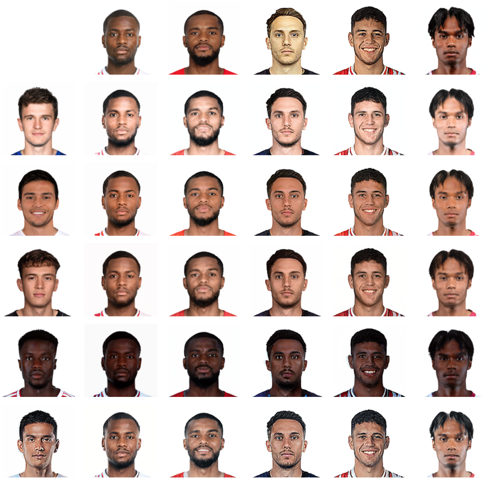

# avatar-generator-2

## Face Generation


## Face Fusion


## How to Use
```
fg = FaceGen()
img, _ = fg.generate()
```

The model could be downloaded from the following link, and be put under the inference folder.
https://drive.google.com/file/d/1499ngvrhxlF_uWla0E_gcZHX-8nN61OM/view?usp=sharing
